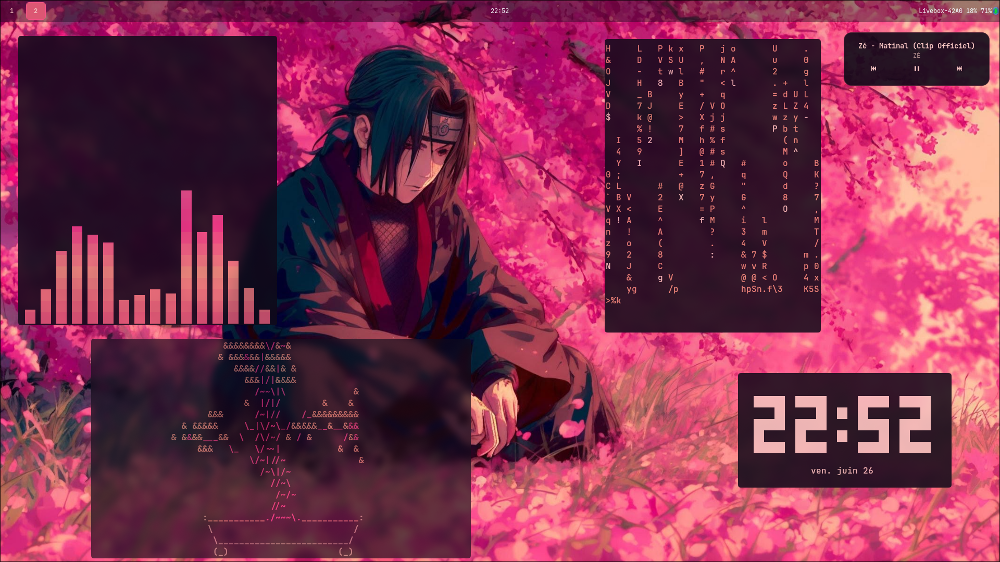

# Arch Linux / Hyprland Dotfiles
Configuration personnelle pour mon setup Arch Linux sous Hyprland.
Ces dotfiles sont adaptés à mon matériel spécifique, lisez avant de copier-coller.
## Screenshot

## Stack
- WM : Hyprland
- Shell : Zsh
- File manager : Thunar
- App launcher : Rofi
- Status bar : Waybar
- Logout menu : wlogout
- Font : JetBrains Mono
- Colorscheme : pywal (wal)
## ⚠️ Important
Cette configuration est taillée pour mon matériel.
Certains paramètres (résolution, touchpad, GPU) devront être adaptés au vôtre.
Lisez chaque fichier avant de l'appliquer.
## Structure
- config/ → configurations des applications
- wal/ → thèmes pywal
- .zshrc → configuration shell
- JetBrains_Mono/ → police d'écriture
## Installation
Pas de script automatique, installation manuelle recommandée.
